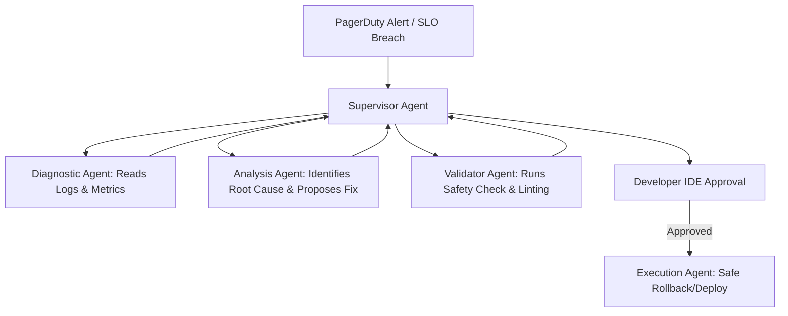

# Application & Screen Preparation Answers: Reliability Platform

This document prepares **Archilles Jacob Azameti** for technical screens and potential application questionnaire fields for the Software Engineer — Reliability Platform position.

---

### **Q1: SRE vs. SWE Tradeoff & Preventing Toil**
*Prompt: DoorDash’s Production Lifecycle team approaches challenges with the pragmatic perspective of an SRE but delivers solutions with the mindset of a SWE who detests toil. How have you balanced these perspectives, and how do you decide between a quick operational fix versus a long-term software solution?*

#### **Core Philosophy:**
Toil is operational work that is manual, repetitive, automatable, tactical, and lacks long-term value. SREs identify where the system is breaking; SWEs build the platform that prevents it from breaking in that way again. My approach is to treat operational incidents as telemetry: a single occurrence is a ticket, a recurring pattern is a design flaw in the platform.

#### **Jake's Experience & Examples:**
*   **The quick fix vs. platform solution:** In my onboarding automation work, the client was running a 12-step manual process to move data across Jotform, Gmail, and their clinical management CRM. Rather than writing a script to run on a local cron job (a fragile, quick fix), I designed a clean event-driven pipeline in **n8n** utilizing **Claude** to route data, handle retries, and log HIPAA-compliant audit trails.
*   **Building self-service capabilities:** In my work on **UmukoziHR**, candidate data was ingested from multiple third-party endpoints. Instead of having developers manually debug when an API changed (causing toil), I built automated integration tests and LLM-as-a-judge scorers that monitored the reliability of raw scraped data, sending alerting metrics directly to our logs before it caused failures in the candidate matching pipeline.
*   **Telemetry obsessions:** SRE requires reasoning about health. At **Sono Health**, I automated report diagnostics. Telemetry formatting was a bottleneck; rather than manually formatting PDFs for clinics, I built an automated LaTeX generator that ingested patient metrics and peer-reviewed diagnostics directly to compile structured documents programmatically, saving clinicians hours of manual toil.

---

### **Q2: Designing Secure and Scalable MCP Server Backends**
*Prompt: DoorDash relies on Model Context Protocol (MCP) to provide a standardized tool-access menu for internal AI agents. If you were tasked with building a secure, production-grade MCP server for the Reliability Platform to allow agents to interact with Kubernetes clusters or Kafka topics, how would you design it?*

#### **System Architecture & Design:**
An MCP server acts as a bridge between LLMs (or agents) and internal APIs/databases. A production-grade MCP server must prioritize **security, typing, and observability**.

1.  **Strict Typing & Schema Validation (Zod / Pydantic):**
    *   Every tool exposed via the MCP server must have rigid input schemas. For instance, if an agent uses a tool to inspect a Kafka topic description, the topic name must be validated against a strict regex whitelist. No shell-style parameters or arbitrary strings should be passed to execution scripts to prevent command/SQL injection.
2.  **Authentication & Granular Authorization (IAM / RBAC):**
    *   The MCP server should not run with root permissions. It should proxy the requesting user's identity. If an AI agent running in a developer's IDE requests to restart a pod, the MCP server must forward that user's SSO/JWT token, validating that the developer has write permissions on that specific namespace in Kubernetes.
3.  **Idempotency & Read-Only Segregation:**
    *   Expose separate "read" and "write" tools. An agent troubleshooting an incident should only be granted access to read tools (e.g., `get_service_logs`, `check_slo_status`) by default. Write tools (e.g., `scale_replicas`, `trigger_rollback`) must require explicit approval gates (human-in-the-loop) before the MCP server executes them.
4.  **Rate Limiting & Circuit Breakers (Redis):**
    *   AI agents can enter loops (e.g., calling the same log inspection endpoint 1,000 times in a minute). The MCP server must implement Token Bucket rate-limiting using **Redis** and circuit breakers on downstream dependencies (like Prometheus or AWS CloudWatch) to prevent the agent from accidentally DOSing internal services.

#### **Jake's Experience & Examples:**
I have built multiple backends that expose local operations to external models securely. At UmukoziHR, the multi-agent recruiter performed real-time web scraping and candidate evaluations. I designed API endpoints with strict rate limits, Redis caching to prevent duplicate scraper executions, and token tracking to ensure third-party API costs remained bounded.

---

### **Q3: Multi-Agent Orchestration for Reliability Operations**
*Prompt: DoorDash is moving toward proactive, agentic self-healing operations. How do you design multi-agent workflows that can propose, validate, and safely execute production changes?*

#### **Hierarchical Agent Framework:**
Having a single agent try to understand everything and execute actions is unsafe and prone to hallucination. Instead, a multi-agent system should be divided into specialized, single-responsibility agents coordinated by a Supervisor, similar to the architecture I built for **UmukoziHR**:

1.  **Supervisor Agent (State & Orchestration):**
    *   Maintains the state of the incident response and delegates sub-tasks.
2.  **Diagnostic Agent (Service Health):**
    *   Responsible for fetching metrics, logs, and trace telemetry (Service Health). It uses read-only tools to compile the incident context.
3.  **Analysis Agent (Incident Management):**
    *   Compares current telemetry against historical error budgets and recent deployment logs to identify the root cause of an anomaly.
4.  **Validator Agent (Safety Check):**
    *   Reviews proposed operations (e.g., a proposed Kubernetes replica adjustment or feature flag flip) against security and architectural policies, simulating the change in staging or validating parameters before execution.
5.  **Execution Agent (Change Orchestration):**
    *   Executes the change only after receiving explicit approval from the developer via their IDE or dashboard.

#### **Jake's Experience & Examples:**
In my project **UmukoziHR**, a single agent was not sufficient to handle candidate aggregation and scoring. I built a `SupervisorAgent` that orchestrated a `ResearchAgent` (searching platforms in parallel), an `AggregationAgent` (caching and deduplicating profiles in PostgreSQL), and an `AnalysisAgent` (scoring fit based on strict criteria). Using this multi-agent hierarchy compressed a complex manual process that took weeks into minutes, while maintaining deterministic quality boundaries. I can apply this exact architectural pattern to design DoorDash's SRE agent workflows.
